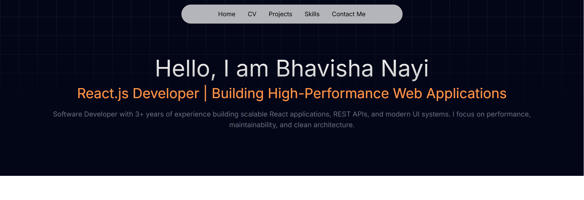

# 👩‍💻 Bhavisha Nayi  
### Frontend Developer | React.js | Next.js | TypeScript



A modern **developer portfolio** built with **Next.js, React.js, TypeScript, and Tailwind CSS** to showcase my professional experience, real-world production work, and frontend engineering skills.

🔗 **Live Portfolio**  
https://port-folio-website-chi.vercel.app/

---

# 🚀 Tech Stack

### Frontend


### Styling


### Tools


---

# 📌 About This Portfolio

This project was built to showcase my **frontend development skills and production experience**.

The portfolio focuses on:

- Clean UI design
- Smooth user experience
- Responsive layouts
- Modern React architecture
- Professional project presentation

Sections included in the website:

- Hero / Introduction
- Skills
- Featured Projects
- Technical Highlights
- Contact

---

# ⭐ Featured Projects

## 🧩 Dynamic Forms Module – Vagaro

Worked on a scalable **Forms system used across multiple Vagaro modules**:

- Forms
- Calendar
- Checkout
- Customer

### Key Features

- Forms dashboard with actions  
  - Duplicate  
  - Delete  
  - Copy Link  
  - Embed Code  
  - View Responses  

- Multiple response views
  - Summary view
  - Individual response view
  - Dynamic table view

- Dynamic table rendering based on form structure

- Print & download functionality for responses

- Form builder system
  - Create forms
  - Edit forms
  - Duplicate forms

- API integration for saving and retrieving form data

### Dot Phrase System

A productivity feature allowing predefined phrases to be inserted into form text editors.

Typing `.` followed by the phrase title automatically inserts the full description.

⚠️ Source code cannot be shared due to company confidentiality.

---

## 🛒 ElwoTools

Production e-commerce platform where I contributed to UI development.

### Contributions

- Product listing UI
- Product detail pages
- Shopping cart functionality
- Admin panel features
- Responsive design improvements

🌐 Live Site  
https://www.elwotools.se/

---

## 🎮 Rock Paper Scissors

Interactive browser game built using JavaScript.

Features:

- Dynamic score tracking
- Randomized computer choices
- Auto play functionality
- Reset option
- Responsive UI

🌐 Live Demo  
https://bhavisha2801.github.io/rock-paper-scissors/

---

## 🌐 Your Product Partners

Developed profile layouts and automation workflows.

Features:

- Profile management system
- Dynamic form submissions
- Automated email notifications

🌐 Website  
https://www.yourproductpartners.com/

---

# ✨ Portfolio Features

- Responsive UI
- Smooth scroll navigation
- Dark mode support
- Modern UI components
- Featured project case studies
- Performance optimized

---

# 📂 Project Structure

```
portfolio/
│
├── app/
│   ├── layout.tsx
│   ├── page.tsx
│
├── components/
│   ├── Navbar.tsx
│   ├── Footer.tsx
│
├── sections/
│   ├── Hero.tsx
│   ├── Skills.tsx
│   ├── Projects.tsx
│   ├── TechnicalHighlights.tsx
│   ├── Contact.tsx
│
├── public/
│   └── images/
│
├── utils/
│   └── cn.ts
│
├── tailwind.config.js
├── package.json
└── README.md
```

---

# ⚙️ Getting Started

Clone the repository

```bash
git clone https://github.com/Bhavisha2801/PortFolio_Website.git
```

Install dependencies

```bash
npm install
```

Run development server

```bash
npm run dev
```

Open browser

```
http://localhost:3000
```

---

# 🚀 Deployment

This project is deployed using **Vercel**.

Steps:

1. Push repository to GitHub
2. Import project in Vercel
3. Deploy automatically

---

# 📊 GitHub Stats


---

# 📬 Contact

**Bhavisha Nayi**  
Frontend Developer

📧 Email  
nayibhavisha@gmail.com  

💻 GitHub  
https://github.com/Bhavisha2801  

💼 LinkedIn  
https://www.linkedin.com/in/bhavisha-nayi-2b683a211/

---

# 📄 License

This project is open-source and available for learning and inspiration.
